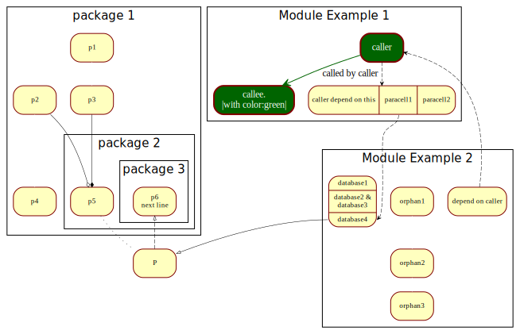
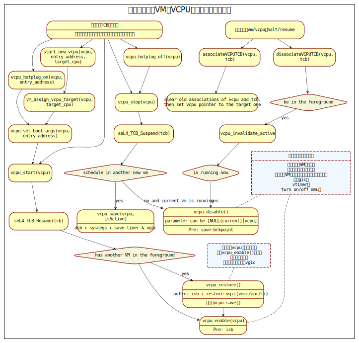
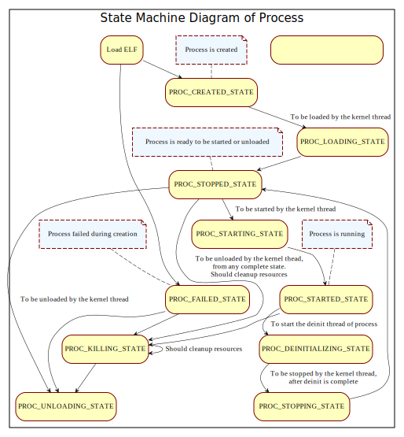
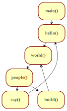
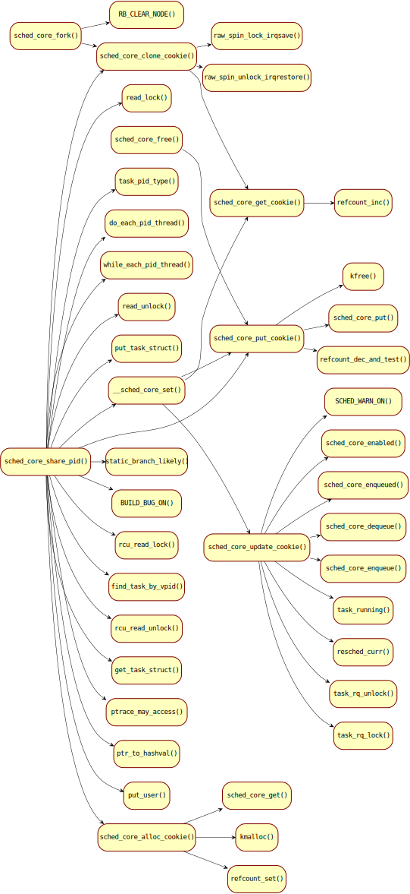
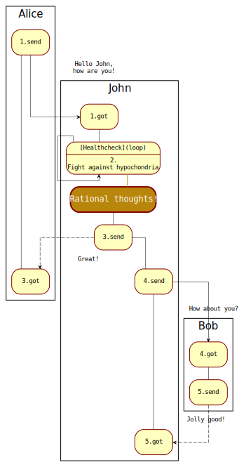

# **Simple **

It's an easy, immediate, efficient, intuitive and extensible design-drawing tool.


## Example 1

```
./flowchart.sh.sh example/exmaple1.txt
```



## Example 2

```
./flowchart.sh.sh example/exmaple2.txt
```



## Example 3

```
./flowchart.sh.sh example/example3.txt
```



## Example 4

```
./flowchart.sh.sh -c example/code.c example/code2.c
```



## Example 5

Automatically draw the call diagram

```
flowchart.sh -d LR -c code/linux/kernel/sched/core_sched.c
```




## Example 6

A swimlane diagram that can represent a time sequence

```
 flowchart.sh -s example/example4.txt
```




## Introduction

In design and development, engineering, notes, documents, and drawings are usually related, but spatially isolated; It's a bit of a headache to draw in a complex way, to switch angles, to do a lot of repetitive work, and possibly to modify, tweak, and refactor constantly.  

 

Control Flow hopes to help users really improve efficiency, synchronously complete these several things, and guide users to produce certain forms of output in the process of research, design and development, and play the role of complementation, induction and feedback. You want to make documentation and drawings useful from the start.  

 

If you don't want to intervention and control, need only simple program for graphical automatically, and does not focus on the content of drawings, this tool may be more suitable for you: [[SciTools]understand](https://www.scitools.com/)、[CodeQuery: A code-understanding, code-browsing or code-search tool](https://github.com/ruben2020/codequery)、[CodeViz: A CallGraph Visualiser (github.com)](https://github.com/petersenna/codeviz)

 

If you prefer to draw first and automatically generate code frames, these tools may be for you  ： [Flowgorithm - Flowchart Programming Language](http://flowgorithm.org/)、https://www.gituml.com/、 [Code Generation - Turn Your Diagram to Code - Software Ideas Modeler](https://www.softwareideas.net/code-generation-diagram-to-code) 


If you want to use a sophisticated IDE with industry-approved tools

： Enterprise Architect （Personal opinion: not a fan of UML, more concerned with communicating intent in an appropriate and understandable way  ）；light weight free tool recommend Umbrello、亿图 and Topology

If you want to add personality and variety to your drawings in more detail, these tools may be for you： [GitHub - jgraph/drawio-desktop: Official electron build of diagrams.net](https://github.com/jgraph/drawio-desktop) 、 [yEd - Graph Editor (yworks.com)](https://www.yworks.com/products/yed) 

If you want to inspect any of the existing open source tools again： [GitHub - antvis/G6: ♾ A Graph Visualization Framework in JavaScript](https://github.com/antvis/G6) 、 [GitHub - mingrammer/diagrams: Diagram as Code for prototyping cloud system architectures](https://github.com/mingrammer/diagrams) 、 [GitHub - adrai/flowchart.js: Draws simple SVG flow chart diagrams from textual representation of the diagram](https://github.com/adrai/flowchart.js) 、PlantUML、Mermaid、Graphviz and other Markdown tools


## Setup

Based on shell，graphviz，and cflow（only for c code）。

Debian-based：

```
apt install gawk graphviz cflow
```


Windows-base：

Based on MingW or Cygwin, and please refer to the folder “for windows” for packages you need：

Option 1，

```
cd [Directory of ControlFlow]
export PATH=`pwd`/for_windows:$PATH
```

Option 2，

Or simply copy cflow exe file into “C:\Windows\System32\”.


## Command

```
$ flowchart.sh
-d <[TB|LR]> - direction (default is TB) (example: '-d LR')
-D <num> - depth
-f <name> - function name (-f '' means all functions)
-F <string [string]> - strings to filter out
-c <code-file> - input file is raw code
-s enable swimlane, recommend combination with '-d LR'
-r reverse flow as order as called by
```


## Grammar

Indent can be used by 4 spaces or one Tab.

> Use space as delimiter for symbols, connections, prefix, postfix

| symbol                | effection                                 |
| --------------------- | ----------------------------------------- |
| <none>（Just indent） | invoke flow（Program）or associate（UML）  |

| symbol | effection                                                    |
| ------ | ------------------------------------------------------------ |
| `+`    | heading module（support multiple '+', i.e. multiple layer），but cross module connections should not be under it |
| `:`    | condition                                                    |
| `<`    | invoked flow（Program）or associated by（UML）               |
| `~`    | asynchronous transmission（Program）or depend（UML）         |
| `<~`   | backward asynchronous transmission（Program）or depended by（UML） |
| `#`    | comment                                                      |
| `!`    | customize color (default/darkgoldenrod/deeppink/darkgreen/darkviolet/blue/...) |
| `-`    | queue up with no line                                        |
| `--`   | queue up with line                                           |
| `=`    | link                                                         |
| `{`    | aggregation（UML）                                           |
| `{{`   | composition（UML）                                           |
| `^`    | extend（UML）                                                |
| `^^`   | implement（UML）                                             |

| connection | effection                                  |
| ---------- | ------------------------------------------ |
| `/_`       | subcell (can have multiple ones)           |
| `/\|`       | paracell (can have multiple ones)         |
| `//`       | text one the line                          |
| `/-`       | wrap to next line (can have multiple ones) |

| prefix declare | internal cell                              |
| -------------- | ------------------------------------------ |
| `<alias>`      | define an alias of the subcell or paracell |

| postfix reference | internal cell                  |
| ----------------- | ------------------------------ |
| `/> alias`        | refer to a subcell or paracell |
