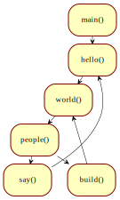
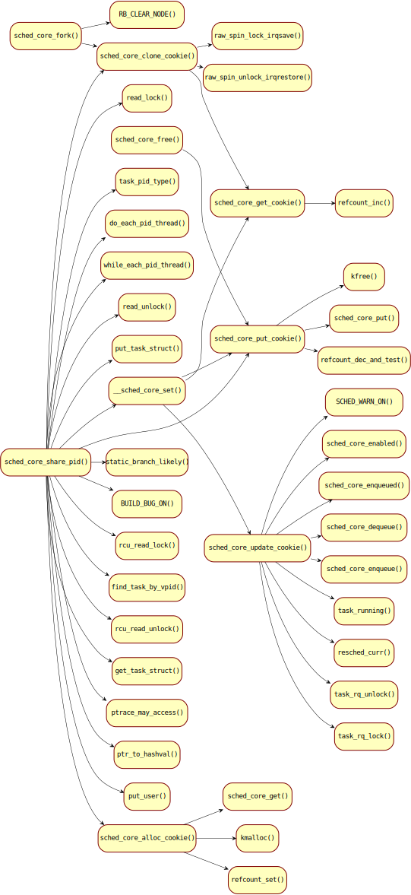

# **Control Flow** v1.2

它是一种简单、即时、高效、直观和可扩展的设计绘图工具。


## 示例一

```
./flowchart.sh.sh example/exmaple1.txt
```


## 示例二

```
./flowchart.sh.sh example/exmaple2.txt
```


## 示例三

```
./flowchart.sh.sh example/example3.txt
```


## 示例四

```
./flowchart.sh.sh -c example/code.c example/code2.c
```



## 示例五

自动绘制调用关系图

```
flowchart.sh -d LR -c code/linux/kernel/sched/core_sched.c
```



## 示例六

可以表达时序的泳道图

```
 flowchart.sh -s example/example4.txt
```


## 介绍

在设计与开发中，工程、笔记、文档和图纸通常是关联的，但又是时空隔离的；对于复杂的画图方式、需要转换角度和一定重复工作，并且可能需要不断的修改、调整和重构，多少令人头疼。

Control Flow希望帮助用户真正提高效率，同步完成这几件事情，引导用户在研究、设计与开发的过程中，已经在产生一定形式的输出，并且起到互补，帮助归纳，反哺的作用。希望让文档和图纸从一开始就变得有用起来。

如果您不希望介入和控制，只需要对简单程序进行自动图形化，并且不关注整理图纸中的内容，这个工具可能更适合你：[[SciTools]understand](https://www.scitools.com/)、[CodeQuery: A code-understanding, code-browsing or code-search tool](https://github.com/ruben2020/codequery)、[CodeViz: A CallGraph Visualiser (github.com)](https://github.com/petersenna/codeviz)

如果您喜欢先画图，并自动生成代码框架，这些工具可能更适合你： [Flowgorithm - Flowchart Programming Language](http://flowgorithm.org/)、https://www.gituml.com/、 [Code Generation - Turn Your Diagram to Code - Software Ideas Modeler](https://www.softwareideas.net/code-generation-diagram-to-code) 

如果您希望使用复杂的IDE，并具有行业认可的工具： Enterprise Architect （个人观点： 不迷信 UML，更关注用适当易懂的方式去传达意图）；轻量级推荐免费的Umbrello、亿图和Topology

如果您希望在图纸中更细致地添加个性、多样的修饰，这些工具可能更适合你： [GitHub - jgraph/drawio-desktop: Official electron build of diagrams.net](https://github.com/jgraph/drawio-desktop) 、 [yEd - Graph Editor (yworks.com)](https://www.yworks.com/products/yed) 

如果您希望自己再次借鉴目前已有的开源工具，可以参考： [GitHub - antvis/G6: ♾ A Graph Visualization Framework in JavaScript](https://github.com/antvis/G6) 、 [GitHub - mingrammer/diagrams: Diagram as Code for prototyping cloud system architectures](https://github.com/mingrammer/diagrams) 、 [GitHub - adrai/flowchart.js: Draws simple SVG flow chart diagrams from textual representation of the diagram](https://github.com/adrai/flowchart.js) 、PlantUML、Mermaid、Graphviz和多种Markdown工具


## 运行环境

Based on GNU shell，graphviz（for 图纸），cflow（for 文本）。

Debian-based：

```
apt install gawk graphviz cflow
```


Windows环境下可以运行MingW或者Cygwin，和目录'for_windows'运行环境：

选项1，

```
cd [Directory of ControlFlow]
export PATH=`pwd`/for_windows:$PATH
```

选项2，

也可以简单将需要的cflow或浏览器的可执行文件拷贝到“C:\Windows\System32\”。


## 命令

```
$ flowchart.sh
-d <[TB|LR]> - direction (default is TB) (example: '-d LR')
-D <num> - depth
-f <name> - function name (-f '' means all functions)
-F <string [string]> - strings to filter out
-c <code-file> - input file is raw code
-s enable swimlane, recommend combination with '-d LR'
-r reverse flow as order as called by
```


## 语法

缩进可以使用4个空格，也可以使用Tab。

| 无符号       | 图形                              |
| ------------ | --------------------------------- |
| 无（仅缩进） | invoke flow（程序）or link（UML） |

下面的符号需要空格作为与内容之间的分隔符

| 符号 | 图形                                                         |
| ---- | ------------------------------------------------------------ |
| `+`  | 标题模块(支持多个'+'，即多层)，但其下方不应存在跨模块连接    |
| `:`  | 条件判断                                                     |
| `<`  | invoked flow（程序）or linked by（UML）                      |
| `~`  | asynchronous transmission（程序）or depend（UML）            |
| `<~` | backward asynchronous transmission（程序）or depended by（UML） |
| `#`  | 批注框                                                       |
| `!`  | customize color (default/read/blue/green/yellow/orange/pink/gray/purple) |
| `-`  | queue up with no line                                        |
| `--` | queue up with line                                           |
| `=`  | link                                                         |
| `{`  | 聚合（UML）                                                  |
| `{{` | 组合（UML）                                                  |
| `^`  | 继承（UML）                                                  |
| `^^` | 实现（UML）                                                  |

| 连接符 | 图形                              |
| ------ | --------------------------------- |
| `/_`   | subcell (can have multiple ones)  |
| `/|`   | paracell (can have multiple ones) |
| `//`   | 连线上的文字                      |
| `/-`   | 换行 (can have multiple ones)     |

| 前缀      | 内部单元的别名                             |
| --------- | ------------------------------------------ |
| `<alias>` | define an alias of the subcell or paracell |

| 后缀       | 指向内部单元的别名                    |
| ---------- | ------------------------------------- |
| `/> alias` | refer to a subcell or paracell        |
